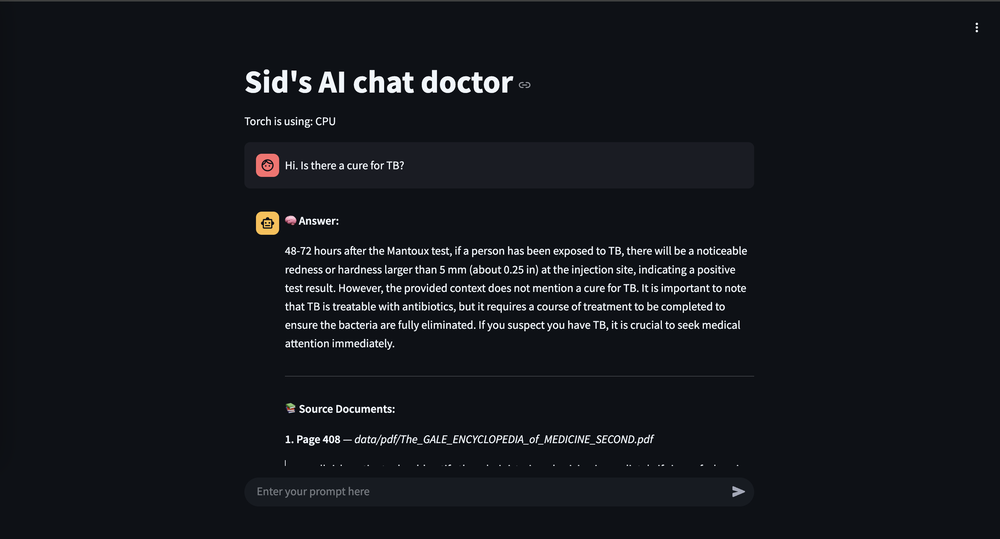

# 🧠 Sid's AI Chat Doctor

https://ai-chat-doc.sidcloud.uk/

A private LLM-powered chatbot trained on trusted medical PDFs using LangChain, FAISS, and HuggingFace.  
Ask health-related questions and get context-aware responses — with source citations.

---

## 🚀 Features

- 🔐 **Secure login** for preconfigured via Streamlit Authenticator
- 📄 Ingests medical PDFs and converts them into searchable vector databases
- 🧠 Powered by **HuggingFace Inference API** with **Mistral-7B-Instruct**
- 🗃️ Uses **FAISS** for local vector similarity search
- 📚 Cites exact source page from the PDF in the response
- 🧑‍⚕️ Clean, dark-themed UI with chat history

---

## 📸 Screenshot



---

## 🧰 Tech Stack

| Tool                  | Role                                |
|-----------------------|-------------------------------------|
| Streamlit             | Frontend & Chat UI                  |
| LangChain             | Prompt orchestration & chains       |
| HuggingFace           | LLM API (Mistral-7B Instruct)       |
| FAISS                 | Vector database (local similarity)  |
| sentence-transformers | Text embedding                      |
| Docker / Pipenv       | Deployment & environment isolation  |
| Cloudflare Tunnels    | Public HTTPS access from LAN Pi     |

---

## 📦 Setup

### 🧪 Prerequisites

- Python 3.10+
- HuggingFace account & API token
- Docker
- `.env` file with your `HF_TOKEN`

### 🔧 Installation

Clone the repo:
```bash
git clone https://github.com/<your-username>/ai-chat-doctor.git
cd ai-chat-doctor
```

Install dependencies:
```bash
pipenv install
```

Generate the FAISS vector DB (1-time setup):
```bash
python create_llm_memory.py
```

Run the app:
```bash
streamlit run aichatdoctor.py
```

---

## 🐳 Docker Deployment

### Build image
```bash
docker build -t ai-chat-doctor .
```

### Run container
```bash
docker run -d -p 8501:8501 --env-file .env ai-chat-doctor
```

---

## ✅ To-Do

- [ ] Mobile-friendly UI
- [ ] Offline model support (e.g. llama.cpp)
- [ ] Streamlit chat enhancements (spinners, markdown formatting)
- [ ] Add PDF preview/source links

---

## 👨‍🔬 Maintainer

Made with ❤️ by [@siddy7](https://github.com/siddy7)  
Built as a personal learning project to explore LLMs, embeddings, and vector search.

---
